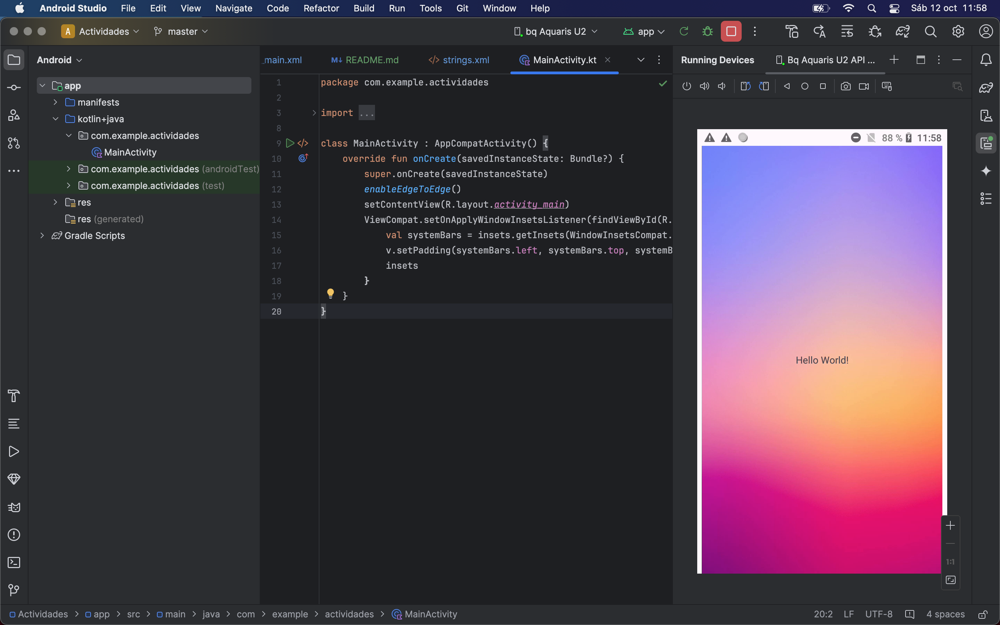
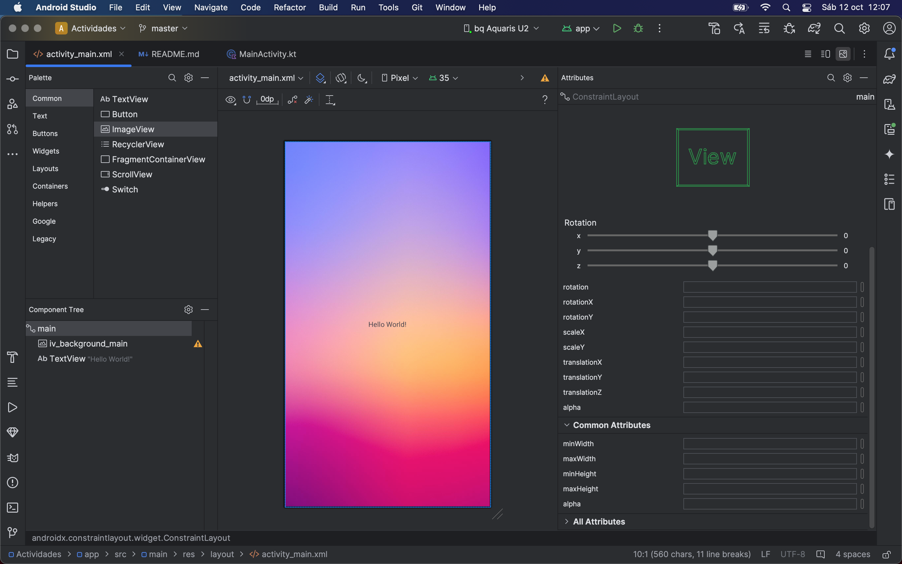
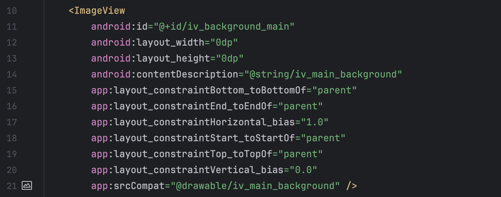
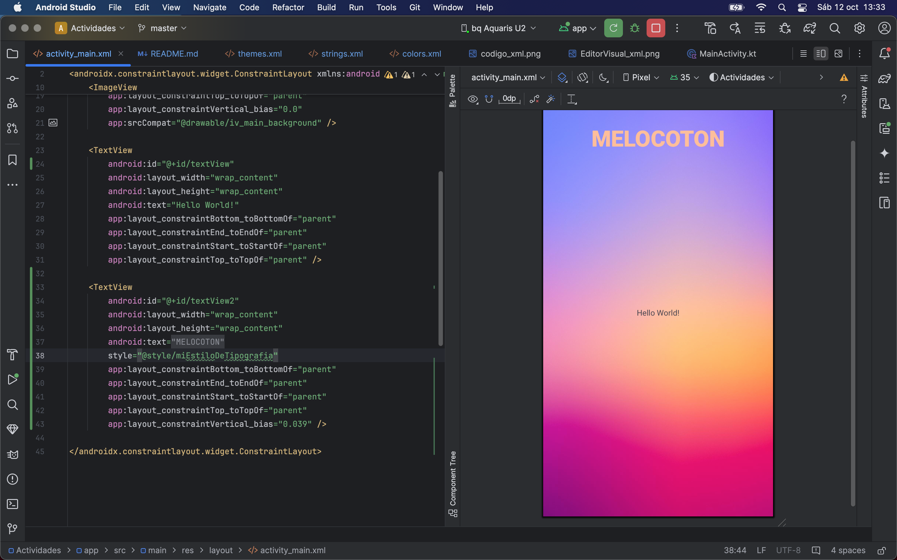

[# ACTIVIDADES
Repositorio: [Repositorio de Actividades](https://github.com/jmoralm/actividades)

A continuación se detalla la documentación de las actividades de Android Studio.

## Actividad 1:
Instalar el entorno de programación y recorrer cada uno de los recursos. 
Crear un recurso de imagen.

1. Entorno de programación creado: 

2. Creación de recurso de imagen:
Se ha añadido una imagen de fondo en la vista main de nuestra app.

`   <ImageView
   android:id="@+id/iv_background_main"
   android:layout_width="0dp"
   android:layout_height="0dp"
   android:contentDescription="@string/iv_main_background"
   app:layout_constraintBottom_toBottomOf="parent"
   app:layout_constraintEnd_toEndOf="parent"
   app:layout_constraintHorizontal_bias="1.0"
   app:layout_constraintStart_toStartOf="parent"
   app:layout_constraintTop_toTopOf="parent"
   app:layout_constraintVertical_bias="0.0"
   app:srcCompat="@drawable/iv_main_background" />`

3. Vista del editor visual de nuestra app. 

4. Vista del código xml del imageView

## ACTIVIDAD 2:
Jugar con el fichero styles.xml para el tema de los colores. 
Definir nuevos item con códigos de colores dentro del mismo style.

1. Se han creado colores personalizados en el fichero colors.xml

`<resources>
<color name="black">#FF000000</color>
<color name="white">#FFFFFFFF</color>
<color name="miAzul">#1946B5</color>
<color name="melocoton">#FEBE98</color>
</resources>`

2. Se ha creado un estilo propio de tipografía incorporando varios items en su interior.

``

3. Se ha aplicado nuestro estilo personalizado a un nuevo elemento de tipo texto en nuestra app.

